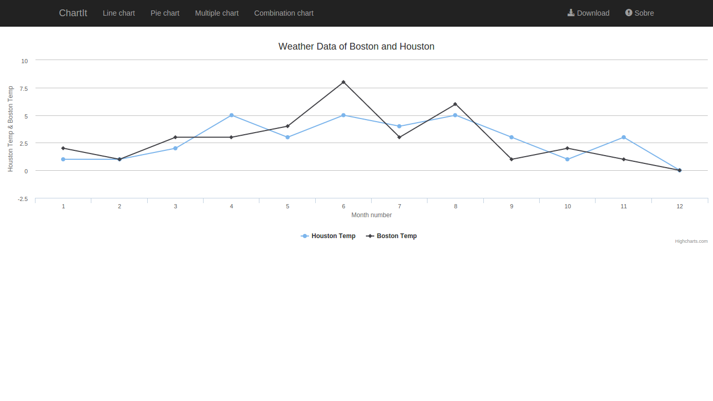
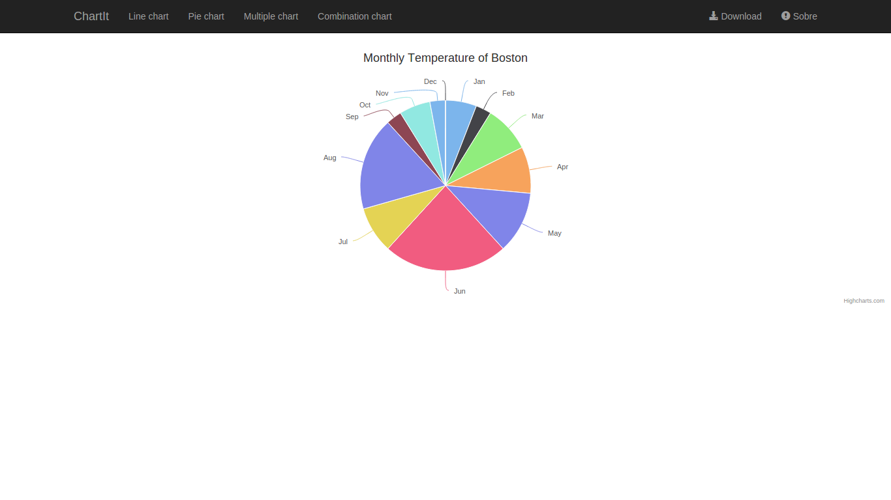
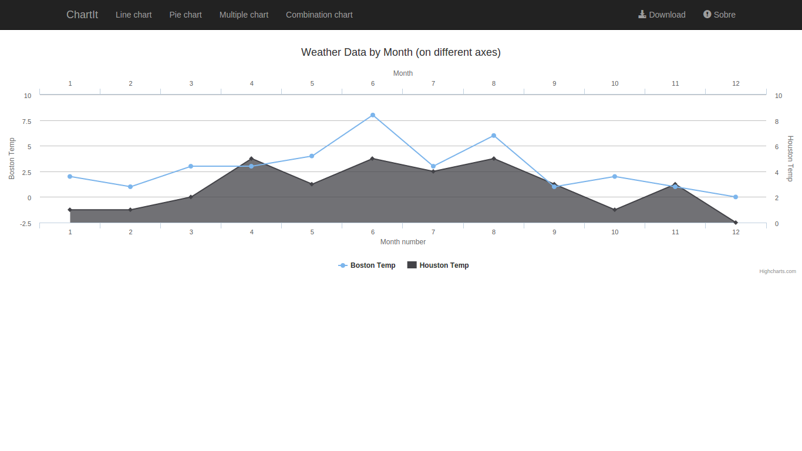
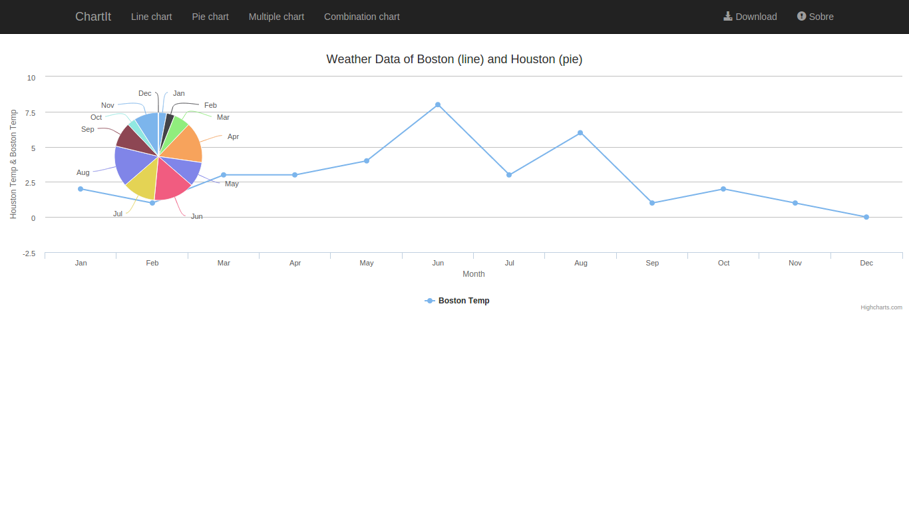

# chartit

Example usage [django-chartit][0].

*Django 1.7 e Python 2.7*

	$ git clone https://github.com/rg3915/chartit.git
	$ virtualenv chartit
	$ cd chartit
	$ source bin/activate
	$ pip install -r requirements.txt
	$ python manage.py makemigrations core
	$ python manage.py migrate
	$ python manage.py createsuperuser
	$ python manage.py loaddata fixtures.json

**Obs**: Edite o arquivo

``lib/python2.7/site-packages/chartit/templatetags/chartit.py``

	- from django.utils import simplejson
	+ import simplejson

Fonte: http://stackoverflow.com/a/25839210/802542

	$ python manage.py runserver

## Screenshots

linechart

piechart

multiplechart

combinationchart

[0]: https://github.com/pgollakota/django-chartit/